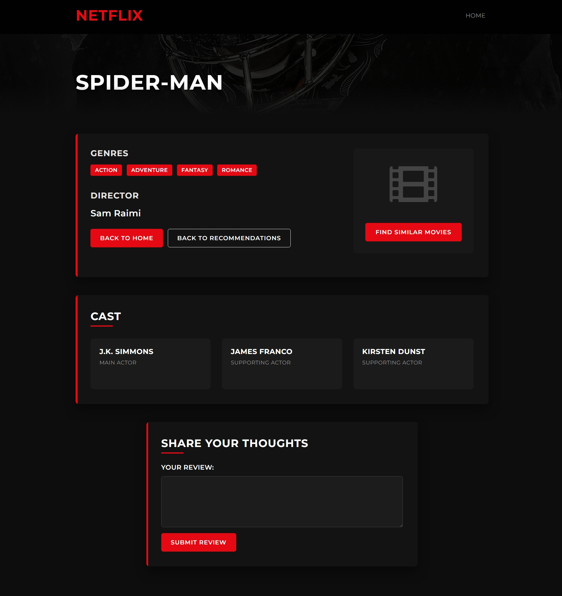

# Netflix Movie Recommendation System

A Flask-based web application that recommends movies similar to your favorites and performs sentiment analysis on reviews. With a Netflix-inspired UI, this system provides an engaging way to discover new movies based on content similarity.

## 🌐 Live Demo

You can access the live application at: [netflixrecommendation-f2bvgzbka0ghebbb.centralus-01.azurewebsites.net](https://netflixrecommendation-f2bvgzbka0ghebbb.centralus-01.azurewebsites.net)

## 📋 Features

- **Movie Search**: Search for movies from an extensive database of popular films
- **Smart Recommendations**: Get personalized movie recommendations based on content similarity
- **Movie Details**: Access comprehensive information about movies including director, cast, and genres
- **Sentiment Analysis**: Submit reviews for movies and receive instant AI-powered sentiment analysis
- **Netflix-inspired UI**: Enjoy a sleek, responsive dark interface with familiar Netflix aesthetics
- **Containerized Deployment**: Easily deployable through Docker
- **CI/CD Pipeline**: Automated deployment to Azure using GitHub Actions

## 🖼️ Screenshots

<div align="center">
  
  <br>
  <br>
  <p><i>Homepage with Netflix-inspired design</i></p>
  <br>
  <br>
  
  <br>
  <br>
  <p><i>Movie recommendations based on user selection</i></p>
  <br>
  <br>
  
  <br>
  <br>
  <p><i>Detailed information about a selected movie</i></p>
  <br>
  <br>
  
  <br>
  <br>
   
   <br>
  <br>
  <p><i>Sentiment analysis of user reviews</i></p>
</div>

## 🛠️ Technologies Used

- **Python 3.x**: Core programming language
- **Flask**: Web framework for building the application
- **Pandas**: Data manipulation and analysis
- **scikit-learn**: Machine learning for recommendations and sentiment analysis
- **NLTK**: Natural Language Processing for text analysis
- **Bootstrap**: Frontend framework for responsive design
- **TF-IDF Vectorization**: For feature extraction from movie data
- **Cosine Similarity**: Algorithm for finding similar movies
- **Naive Bayes Classifier**: For sentiment analysis of reviews
- **Docker**: Containerization for consistent deployment
- **GitHub Actions**: CI/CD pipeline for automated testing and deployment
- **Azure Web App**: Cloud hosting platform

## 📂 Project Structure

```
Netflix-Recommendation/
│
├── app/                      # Flask application
│   ├── __init__.py           # Flask app initialization
│   ├── routes.py             # Application routes and recommendation logic
│   ├── static/               # Static files (CSS, JS)
│   └── templates/            # HTML templates
│       ├── index.html        # Homepage with search functionality
│       ├── recommend.html    # Recommendations display page
│       ├── movie_details.html # Detailed movie information
│       └── review.html       # Sentiment analysis results
│
├── datasets/                 # Data files
│   └── reviews.txt           # Movie reviews for model training
│
├── notebooks/                # Jupyter notebooks
│   └── data5_process.ipynb   # Model training and processing notebook
│
├── screenshots/              # Application screenshots
│
├── .github/                  # GitHub Actions workflows
│   └── workflows/
│       ├── main_netflixrecommendation.yml  # Azure deployment workflow
│       └── cicd.yml          # CI/CD pipeline configuration
│
├── main_data.csv             # Main movie dataset with features
├── nlp_model.pkl             # Serialized Naive Bayes model for sentiment analysis
├── tranform.pkl              # Serialized TF-IDF vectorizer
├── Dockerfile                # Docker container configuration
├── run.py                    # Script to run the Flask application
└── requirements.txt          # Python dependencies
```

## ⚙️ Installation and Setup

1. **Clone the repository**:
   ```bash
   git clone https://github.com/suyash-04/Netflix-Recommendation.git
   cd Netflix-Recommendation
   ```

2. **Create and activate a virtual environment**:
   ```bash
   python -m venv venv
   
   # On Windows
   venv\Scripts\activate
   
   # On macOS and Linux
   source venv/bin/activate
   ```

3. **Install required dependencies**:
   ```bash
   pip install -r requirements.txt
   ```

4. **Run the application**:
   ```bash
   python run.py
   ```

5. **Access the application**:
   Open your web browser and navigate to `http://localhost:80`

## 🐳 Docker Deployment

You can also run the application using Docker:

```bash
# Build the Docker image
docker build -t netflix-recommendation .

# Run the container
docker run -p 5000:5000 netflix-recommendation
```

## 🚀 CI/CD Pipeline

This project uses GitHub Actions for continuous integration and deployment:

1. **Automated Workflow**: Triggers on push to the main branch
2. **Data Download**: Automatically retrieves the required dataset
3. **Docker Build**: Builds and pushes the container image to Azure Container Registry
4. **Azure Deployment**: Deploys the application to Azure Web App

## 🚀 How to Use

1. **Find Movies**: 
   - Enter or select a movie you like from the homepage dropdown
   - The dropdown includes a comprehensive list of available movies

2. **Get Recommendations**: 
   - Click "GET RECOMMENDATIONS" to see similar movies
   - The system uses content-based filtering to find matches

3. **Explore Movie Details**: 
   - Click on any recommended movie to view detailed information
   - See director, actors, genres and other relevant information

4. **Analyze Sentiments**: 
   - Submit a review for any movie
   - Our AI will instantly analyze whether your review is positive or negative

## 🧠 Machine Learning Models

- **Movie Recommendation Engine**:
  - Uses TF-IDF (Term Frequency-Inverse Document Frequency) to vectorize movie features
  - Implements cosine similarity to measure content similarity between movies
  - Considers factors like genres, directors, actors, and plot elements

- **Sentiment Analysis Model**:
  - Utilizes a Naive Bayes classifier trained on movie reviews
  - Achieves over 97% accuracy on test data
  - Processes text using NLP techniques to extract meaningful features

## 📊 Data Sources

The application uses a curated dataset of movies with features including:
- Movie titles and release years
- Director and actor information
- Genres and plot keywords
- Other metadata to improve recommendation quality

## 🔮 Future Enhancements

- User accounts and personalized recommendations
- Integration with external APIs for real-time movie data
- Collaborative filtering to complement content-based recommendations
- Enhanced UI with trailer previews
- Mobile application development

## 📄 License

This project is licensed under the MIT License - see the [LICENSE](LICENSE) file for details.

## 🙏 Acknowledgements

- Data sourced and adapted from public movie datasets
- Special thanks to the Flask, scikit-learn and NLTK communities